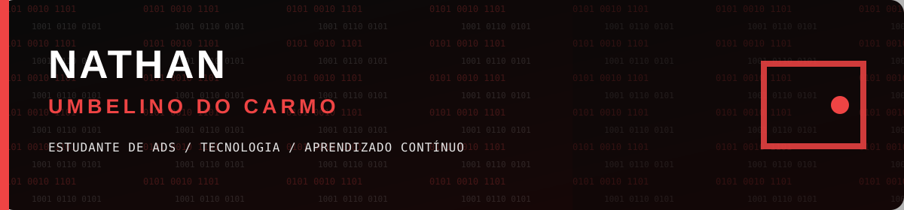

Estudante de **Análise e Desenvolvimento de Sistemas**, construindo minha trajetória na tecnologia. Meu interesse começou no primeiro emprego, quando eu usava bastante o Pacote Office e passei a perceber como as ferramentas digitais ajudam a resolver tarefas do dia a dia. A partir daí, quis entender melhor como os programas são feitos e comecei a estudar desenvolvimento de software.

## Atualmente

- 🎓 Estudando Análise e Desenvolvimento de Sistemas.
- 💻 Aprendendo fundamentos de programação e desenvolvimento web com **HTML, CSS e JavaScript**.
- 🧠 Explorando lógica de programação, Python, C++ e bancos de dados.
- 🎮 Gosto de videogames antigos e de descobrir como a programação dá vida aos jogos.

## Objetivos

Quero fortalecer minha base em programação, criar projetos próprios e avançar no desenvolvimento de software. Também tenho interesse em back-end, APIs e bancos de dados.

## Projetos e estudos

- [Ocarmoz](https://github.com/nathan1234umbelino-beep/Ocarmoz) — meu projeto pessoal e apresentação.
- [Minha identidade na Web](https://nathan1234umbelino-beep.github.io/projeto1-minha-identidade-na-web/) — atividade acadêmica desenvolvida com HTML e CSS.
- [Exercícios de lógica](https://github.com/nathan1234umbelino-beep/exercicios-logica) — repositório de estudos.

## Vamos nos conectar

Estou começando minha jornada e usando cada projeto para aprender, praticar e evoluir.
